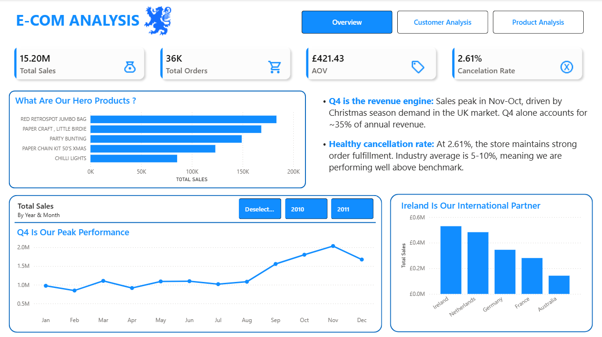
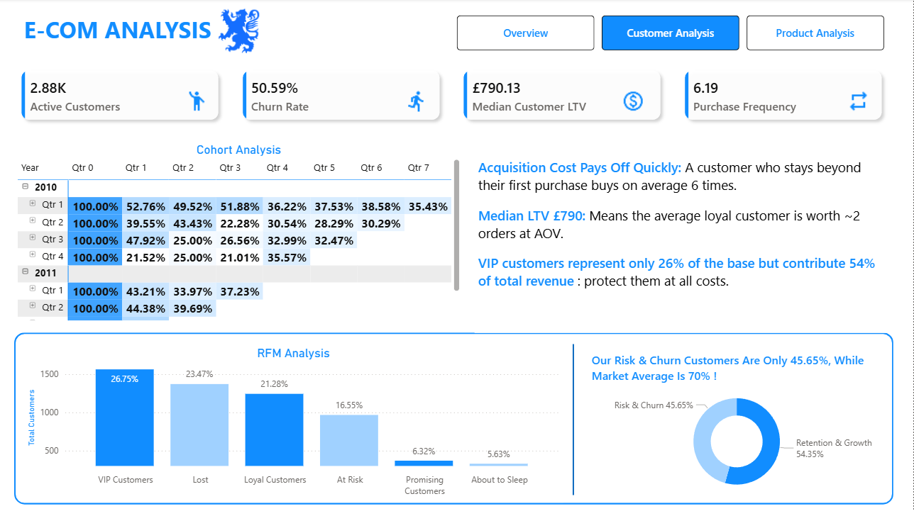
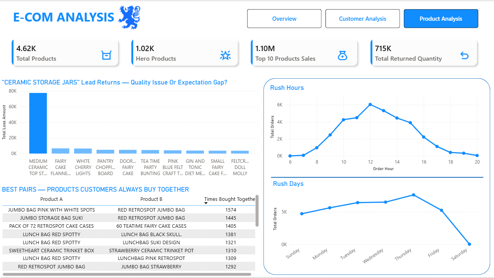

# 🛒 E-Commerce Sales Analysis
**End-to-end data analysis project on a real UK-based online retail store (2009–2011)**

[](https://www.linkedin.com/in/abdelrhman-abotaleb-065a0918b/)

---

## 📌 Project Overview

This project analyzes **1M+ transactions** from a real UK-based wholesale e-commerce store. Starting from a single flat file, I built a relational database, performed deep SQL analysis, and created an interactive Power BI dashboard with actionable business insights.

**Tools Used:** PostgreSQL · Power BI · Excel

**Dataset:** [UCI Online Retail II](https://archive.ics.uci.edu/dataset/502/online+retail+ii) — Real transactional data from 2009 to 2011

---

## 🎯 Business Questions Answered

- What drives revenue, and when does the store peak?
- Who are the most valuable customers, and who is at risk of leaving?
- Which products generate 80% of revenue?
- What products are always bought together?
- Why are customers returning products, and which categories have the highest loss?

---

## 🗄️ Database Architecture

Normalized a single flat file (1,067,371 rows) into 3 relational tables:

```
raw_sales (flat file)
    ├── customers      (customer_id, country)
    ├── products       (stock_code, description, standard_price)
    └── transactions   (invoice, stock_code, customer_id, quantity, invoice_date, price)
```

**Key decisions:**
- `NULL` customer IDs replaced with `'Guest'` to represent guest checkouts
- Uppercase filter applied to descriptions to exclude internal adjustment entries (validated: mixed-case products represent <0.2% of revenue)
- Invoices `581483` and `C581484` excluded as statistical outliers (inflated cancellation rate from 3.54% to 2.61%)

**Advanced SQL Techniques:**
- Utilized `PERCENTILE_CONT(0.5)` for robust Median LTV calculations, `NTILE(5)` for RFM scoring, and optimized self-joins for Market Basket Analysis
- Pushed heavy analytical logic directly to PostgreSQL Views to maintain a lightweight and high-performing Power BI data model

---

## 📊 Analysis Summary

### 💰 Sales Performance
- **Total Revenue:** £15.2M (registered customers)
- **Total Orders:** 36K
- **AOV:** £421 — indicates a B2B-leaning customer base, not typical retail
- **Q4 drives ~35% of annual revenue** — Christmas season in UK market

### 👥 Customer Segmentation (RFM Analysis)
| Segment | Customers | % of Base | % of Revenue |
|---|---|---|---|
| VIP Customers | 1,565 | 26.79% | 71.5% |
| Loyal Customers | 1,246 | 21.33% | 14.2% |
| Lost | 1,369 | 23.43% | 2.2% |
| At Risk | 969 | 16.59% | 10.9% |
| Promising Customers | 367 | 6.28% | 0.7% |
| About to Sleep | 326 | 5.58% | 0.6% |

- **Median LTV:** £790 — significantly above standard retail benchmarks. This store operates as a wholesale B2B distributor, which naturally drives higher LTV, purchase frequency, and AOV compared to typical retail e-commerce
- **Churn Rate:** 50.59% — influenced by 2009 dataset inclusion, as older customers are naturally inactive by 2011
- **Purchase Frequency:** 6.19x — consistent with wholesale B2B buying behavior

### 📦 Product Intelligence
- **21.98% of SKUs generate 80% of revenue** (Pareto Rule confirmed)
- **1,015 Hero Products** out of 4,618 total SKUs
- **Top product pairs** (Market Basket): PINK & GREEN REGENCY TEACUP sets, JUMBO BAG collections — strong bundle opportunity
- **CERAMIC STORAGE JARS** lead returns with ~£80K in lost revenue — potential quality or packaging issue

### 📅 Seasonality
- **Peak hours:** 10 AM – 3 PM (B2B ordering pattern)
- **Peak days:** Thursday & Tuesday
- **No Saturday orders** — reflects the distributor's operating hours and confirms a wholesale/B2B customer base
- **November is the highest revenue month** — Christmas pre-ordering

### 🔄 Cohort & Retention
- First cohort (2010 Q1) retains **52% of customers after Quarter 1**
- Retention stabilizes around **35–50%** across cohorts — healthy for wholesale

---

## 🖥️ Dashboard Preview

### Page 1 — Overview


### Page 2 — Customer Analysis


### Page 3 — Product Analysis


---

## 🔍 Key Insights & Recommendations

1. **Protect VIP customers** — 26.79% of base drives 71.5% of revenue. A targeted loyalty program is high ROI.
2. **Activate At Risk segment** — 16.59% of customers showing disengagement. Launch a targeted re-engagement campaign to win them back before they become permanently Lost.
3. **Bundle hero product pairs** — TEACUP sets and JUMBO BAG collections always bought together. A bundle with small discount increases AOV.
4. **Investigate Ceramic returns** — £80K in returns. Improve packaging or update product images to reduce expectation gap.
5. **Focus inventory on 1,015 Hero SKUs** — 78% of products contribute only 20% of revenue. A SKU rationalization exercise could improve profitability.
6. **Run Q4 campaigns starting September** — Revenue climbs sharply from September. Early inventory stocking and promotions are critical.

---

## 🚀 How to Run This Project

### Prerequisites
- PostgreSQL 18+
- pgAdmin
- Power BI Desktop

### Setup
1. Download the dataset from [UCI Online Retail II](https://archive.ics.uci.edu/dataset/502/online+retail+ii)
2. The Excel file contains **two sheets** — save each as a separate CSV (UTF-8)
3. Create a database called `online_retail` in pgAdmin
4. Run `ecommerce_analysis.sql` in order — it handles table creation, normalization, and all views
5. Connect Power BI to PostgreSQL and load the views

---

## 📁 Repository Structure

```
├── ecommerce_analysis.sql    # Full SQL analysis (setup + 9 analysis sections)
├── dashboard/
│   ├── overview.png
│   ├── customer_analysis.png
│   └── product_analysis.png
└── README.md
```

---

## 👤 About

**Abdelrhman Abotaleb** — Data Analyst & Former Real Estate Sales Manager. Combining commercial business acumen with technical analytics to optimize e-commerce performance, maximize customer lifetime value (LTV), and drive profitability.

[](https://www.linkedin.com/in/abdelrhman-abotaleb-065a0918b/)
